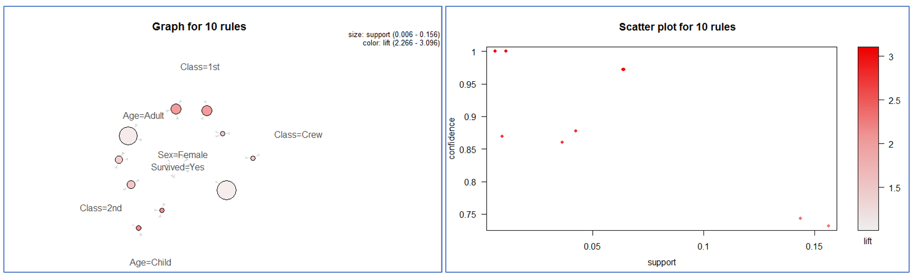

# HNN Project r-arules / Association Rule
This Repo will be reviewed by HNN project hackfest and provide the code of arules package apriori function for R

## About arules
Association analysis is an industry analysis known as shopping cart analysis that finds rules in multiple transactions or trade.  
[arules: Mining Association Rules and Frequent Itemsets](https://cran.r-project.org/web/packages/arules/index.html)  

## Association Rule terms
The association rule can be found using the apriori function in the arules, the package of R. The apriori function is an algorithm for pruning by minimum support.  

**A. Support**  
: In the total transaction, the specific goods A and B are traded at the same time, know how meaningful the rule is.  
= P(A∩B): the number of times A and B occurred at the same time / total number of transactions  

**B. Confidence**  
: The proportion of transactions involving A at the same time, A and B,  
You can see how high the probability B is when an event A occurs.  
= P(A∩B) / A): Number of times A and B occurred at the same time / Number of times A occurred  

**C. Lift**  
The share of A and B traded at the same time is divided by the trading weight at the same time when A and B are independent events. In other words, a measure of how superior the relationship between A and B is than the probability that A and B are traded together by chance.  
= P(A∩B) / A)* P(B|A) : A is the probability that A and B will occur at the same time when A and B are independent events.  

### R aurles - apriori function Execution code
[R code r-arules-script.R](r-arules-script.R)  
[R data file titanic.raw.rdata](data/titanic.raw.rdata)  

```
#################################################
### Hogangnono-hackfest arules evaluation script
#################################################
### Inspect Association rule, using Titanic.rdata example dataset 
### Load R arules package and library
setwd("c:/temp/hogangnono-hackfest")
load("titanic.raw.rdata")
install.packages("arules")  #first time install

#load lib
library(arules)

tit <- titanic.raw

head(tit,3)
```

Idx|Class|Sex|Age|Survived
---|---|---|---|---|
1|3rd|Male|Child|No
2|3rd|Male|Child|No
3|3rd|Male|Child|No

```
str(tit)  #total 2201 rows, 4 columns
```
  
```
'data.frame':	2201 obs. of  4 variables:
$ Class   : Factor w/ 4 levels "1st","2nd","3rd",..: 3 3 3 3 3 3 3 3 3 3 ...
$ Sex     : Factor w/ 2 levels "Female","Male": 2 2 2 2 2 2 2 2 2 2 ...
$ Age     : Factor w/ 2 levels "Adult","Child": 2 2 2 2 2 2 2 2 2 2 ...
$ Survived: Factor w/ 2 levels "No","Yes": 1 1 1 1 1 1 1 1 1 1 ...
```

```
### Execute arules - 1. Parameter default
### Using apriori() function to inspect association rule

rules <- apriori(tit)
```
  
```
Apriori

Parameter specification:
confidence minval smax arem  aval originalSupport maxtime
0.8    0.1    1 none FALSE            TRUE       5
support minlen maxlen target   ext
0.1      1     10  rules FALSE

Algorithmic control:
filter tree heap memopt load sort verbose
0.1 TRUE TRUE  FALSE TRUE    2    TRUE

Absolute minimum support count: 220 

set item appearances ...[0 item(s)] done [0.00s].
set transactions ...[10 item(s), 2201 transaction(s)] done [0.00s].
sorting and recoding items ... [9 item(s)] done [0.00s].
creating transaction tree ... done [0.00s].
checking subsets of size 1 2 3 4 done [0.00s].
writing ... [27 rule(s)] done [0.00s].
creating S4 object  ... done [0.00s].
```

```
### Using inspect() function and check the rule
inspect(rules)
```
  
```
lhs               rhs             support confidence      lift
[1]  {}             => {Age=Adult}   0.9504771  0.9504771 1.0000000
[2]  {Class=2nd}    => {Age=Adult}   0.1185825  0.9157895 0.9635051
[3]  {Class=1st}    => {Age=Adult}   0.1449341  0.9815385 1.0326798
[4]  {Sex=Female}   => {Age=Adult}   0.1930940  0.9042553 0.9513700
[5]  {Class=3rd}    => {Age=Adult}   0.2848705  0.8881020 0.9343750
[6]  {Survived=Yes} => {Age=Adult}   0.2971377  0.9198312 0.9677574
[7]  {Class=Crew}   => {Sex=Male}    0.3916402  0.9740113 1.2384742
[8]  {Class=Crew}   => {Age=Adult}   0.4020900  1.0000000 1.0521033
[9]  {Survived=No}  => {Sex=Male}    0.6197183  0.9154362 1.1639949
[10] {Survived=No}  => {Age=Adult}   0.6533394  0.9651007 1.0153856
[11] {Sex=Male}     => {Age=Adult}   0.7573830  0.9630272 1.0132040
[12] {Sex=Female,Survived=Yes} => {Age=Adult}   0.1435711  0.9186047 0.9664669
[13] {Class=3rd,Sex=Male}     => {Survived=No} 0.1917310  0.8274510 1.2222950
[14] {Class=3rd,Survived=No}  => {Age=Adult}   0.2162653  0.9015152 0.9484870
[15] {Class=3rd,Sex=Male}     => {Age=Adult}   0.2099046  0.9058824 0.9530818
```

```
###Run Association analytics - 2. parameter setting
###Set minlen, support, confidence paramenters / set target rhs(result)
rules2 <- apriori(tit,parameter=list(minlen=2, supp=0.005, conf=0.5), 
                  appearance = list(rhs=c("Survived=No", "Survived=Yes"), default="lhs"),
                  control = list(verbose=FALSE))

rules_sort <- sort(rules2, by="lift")
inspect(rules_sort)
```

```
  lhs                                  rhs            support     confidence lift     
  [1]  {Class=2nd,Age=Child}             => {Survived=Yes} 0.010904134 1.0000000  3.0956399
  [2]  {Class=2nd,Sex=Female,Age=Child}  => {Survived=Yes} 0.005906406 1.0000000  3.0956399
  [3]  {Class=1st,Sex=Female}            => {Survived=Yes} 0.064061790 0.9724138  3.0102430
  [4]  {Class=1st,Sex=Female,Age=Adult}  => {Survived=Yes} 0.063607451 0.9722222  3.0096499
  [5]  {Class=2nd,Sex=Female}            => {Survived=Yes} 0.042253521 0.8773585  2.7159860
  [6]  {Class=Crew,Sex=Female}           => {Survived=Yes} 0.009086779 0.8695652  2.6918608
  [7]  {Class=Crew,Sex=Female,Age=Adult} => {Survived=Yes} 0.009086779 0.8695652  2.6918608
  [8]  {Class=2nd,Sex=Female,Age=Adult}  => {Survived=Yes} 0.036347115 0.8602151  2.6629161
  [9]  {Sex=Female,Age=Adult}            => {Survived=Yes} 0.143571104 0.7435294  2.3016993
  [10] {Sex=Female}                      => {Survived=Yes} 0.156292594 0.7319149  2.2657450
```

```
###Fetch top 10 association rules and build plot by lift order 
install.packages("arulesViz")
library(arulesViz)
  
subrules2 <- head(rules_sort, 10)
plot(subrules2)
plot(subrules2, method="graph")
```

  

It is an Association Rules custom module of Azure Machine Learning which implements arule. It is possible to implement R arule by executing this project in Machine Learning Studio as it is.  

[Azure Machine Learning Studio - Discover Association Rules](https://gallery.cortanaintelligence.com/CustomModule/Discover-Association-Rules-1)  
 
